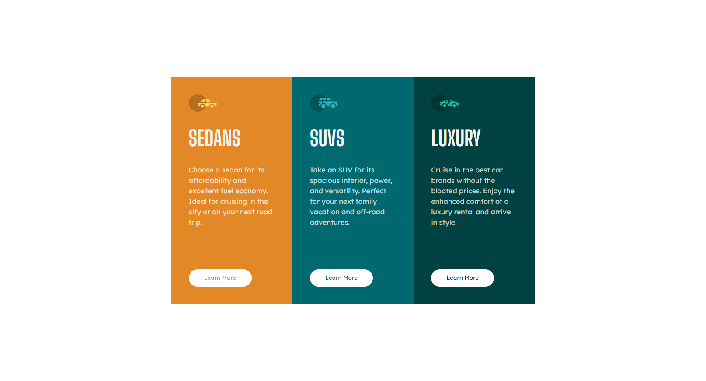

# 3-Column Preview Card Component

## Overview

This project introduces a visually appealing 3-column preview card component designed to display different product categories or services in a compact and engaging layout. Built with HTML and CSS, it features the Big Shoulders Display and Lexend Deca fonts from Google Fonts for a unique typography blend. Each card is dedicated to showcasing a particular offering - Sedans, SUVs, and Luxury vehicles - complete with descriptions and an inviting "Learn More" button.

## Features

- **Responsive Layout:** Ensures the landing page is accessible and looks great on all devices.
- **Custom Typography:** Combines 'Big Shoulders Display' and 'Lexend Deca' fonts for a clean and readable presentation.
- **Interactive UI Elements:** Each card includes a "Learn More" button, designed to guide users towards more detailed information.
- **Visual Hierarchy:** Utilizes color and layout to create a visual distinction between the cards, making the information clear and engaging.

## Screenshots




## Setup

To use this component in your project, follow these steps:

1. **Clone the Repository:**

```bash
git clone https://github.com/Wilmer856/3-column-card-component.git
```

2. **Navigate to the Project Directory:**

```bash
cd 3-column-card-component-main
```

3. **Open the `index.html` file in a web browser to view the component.**

## Customization

- **Content:** Update the headings, descriptions, and images within each '.container' to suit your specific needs or product offerings.
- **Layout:** Modify the HTML structure if needed to add more cards or alter the layout for different content types.
- **Styling:** Adjust the 'style.css' to match your branding, such as colors, fonts, and button styles.

## Dependencies

- Google Fonts: [Big Shoulders Display](https://fonts.google.com/specimen/Big+Shoulders+Display) and [Lexend Deca](https://fonts.google.com/specimen/Lexend+Deca) for typography.
